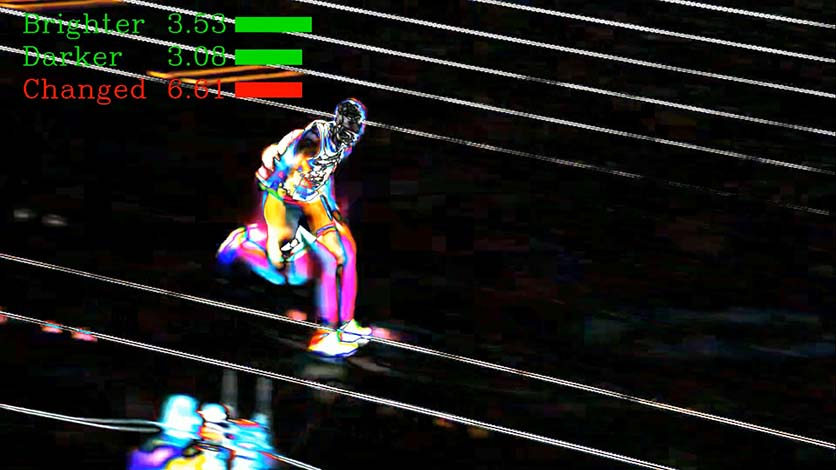
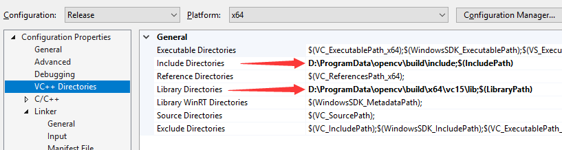
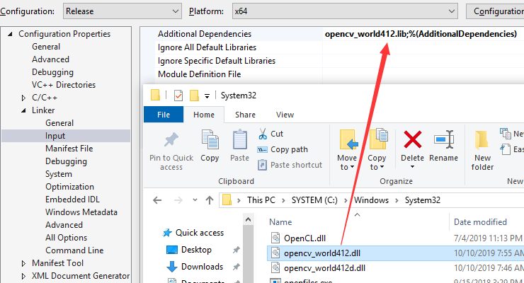

# Video Difference Measurement

Measure the difference between frames in videos. The brightness changes is measured using the average change in each pixel and channel respectively for those brighter and darker. Visualization is applied using the length of green blocks. The red value stand for the absolute value of changes.

(Image captured from "Men's Long Jump Final | Rio 2016 Replay" on YouTube. Available at: https://www.youtube.com/watch?v=fXIbLmlUdOQ )

## Requirements

- Windows 10 x64
- Visual Studio 2019
- OpenCV >= 4.0 (recommended 4.1.2)
- (optional) OpenH264

>For Linux users:
>
>If you are using Ubuntu or other linux system, please use OpenCV of the same version. (I haven't tested on my own yet.) A possible tutorial could be found at:
>
>https://www.learnopencv.com/install-opencv-4-on-ubuntu-18-04/

## Preparation

1. Download and install OpenCV at:

    https://sourceforge.net/projects/opencvlibrary/files/4.1.2/opencv-4.1.2-vc14_vc15.exe/download

2. Add `opencv\build\x64\vc15\bin` to the `Path` in your `Environment Variables`.

3. Open VS2019 and configure the OpenCV include and library directories in the properties "x64 Release".

    

4. Copy the file `opencv_world412.dll` from `opencv\build\x64\vc15\bin` to `C:\Windows\System32` path. Then add the additional depandencies.

    

5. (optional) Download OpenH264 if you would like to employ Open Source H.264 Codec. Available at:

    https://github.com/cisco/openh264/releases

5. Build from `main.cpp`.

## Usage

- Input the filename of the video for testing, and the output result filename. "*.mp4" is recommended.

- If you want to test a camera online, just modify line 10 to:

    `#define CAMERA_ONLINE 1`

- During running, press any key in video window to quit.

- If you do not provide the filename of the input and output, they are respectively the default values "input.mp4" and "output.mp4".

## Todo

- [x] Optical flow estimation

- [x] Support GPU acceleration of GPU by default using OpenCL

- [ ] Check the file readable or camera available

- [ ] Process with the arguments

- [ ] Support multi version of OpenCV
